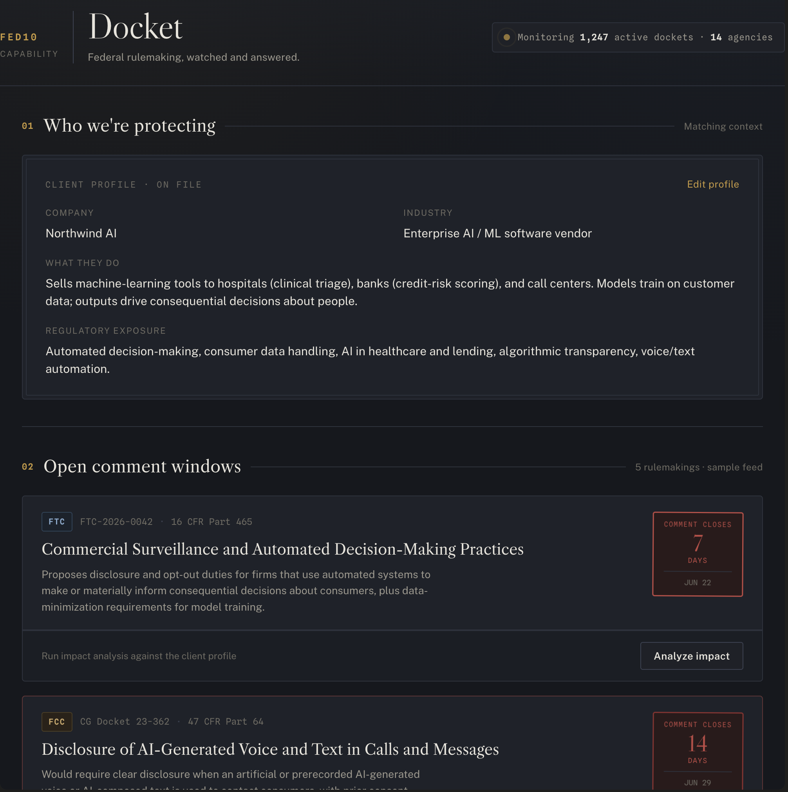
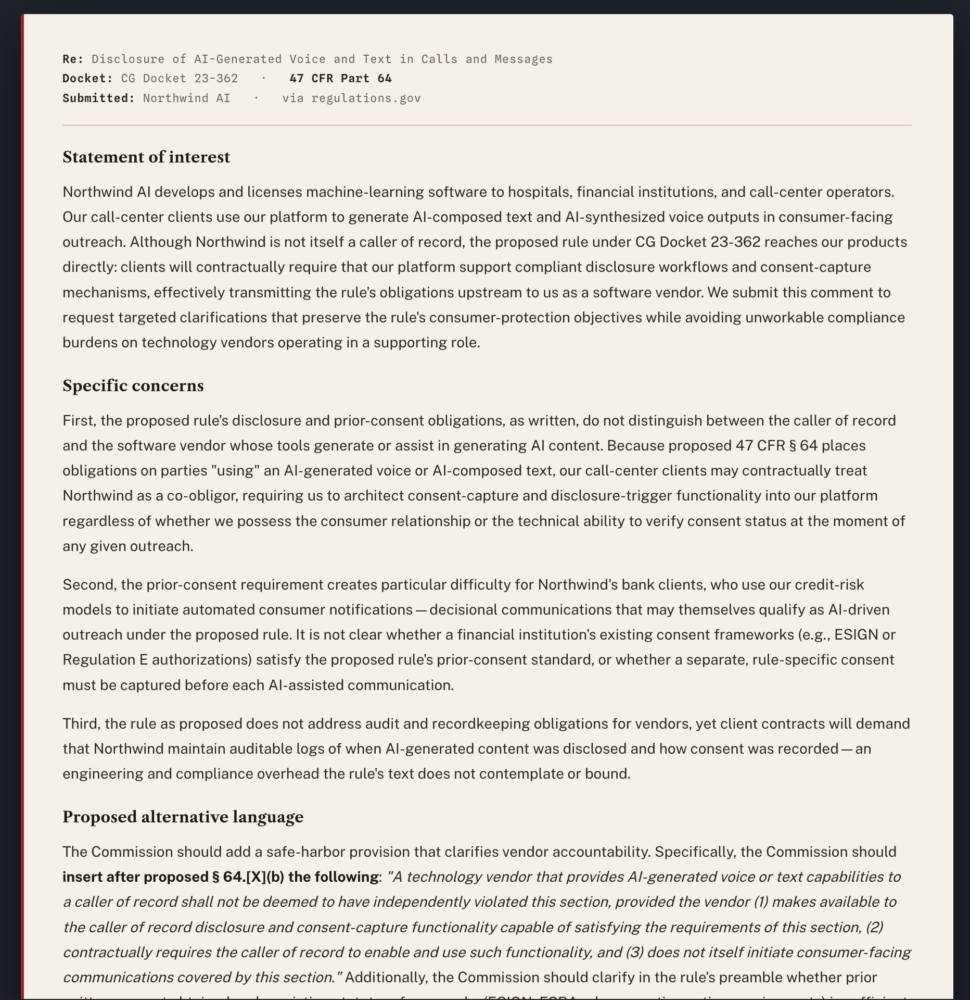
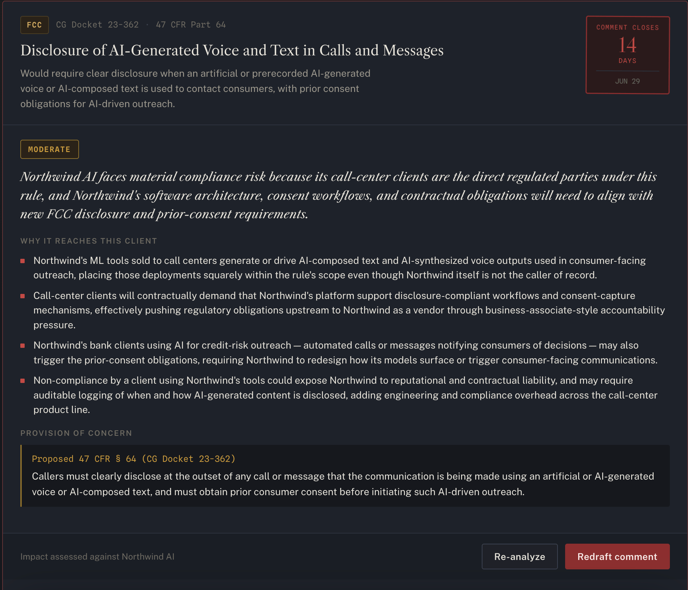

# Docket
 
**Federal rulemaking, watched and answered.**
 
Docket is a regulatory-intelligence module that monitors federal agency rulemaking, reasons about whether each proposed rule threatens a specific company, and drafts a substantive public comment to shape the final rule — before the comment window closes.
 
It is built as a proposed **[Fed10](https://www.fed10.ai)** capability: the same impact-based reasoning Fed10 applies to *legislation*, pointed at *agency rulemaking* instead.
 
---
 
## The problem
 
Most regulatory-monitoring tools watch Congress. But a large share of the regulatory risk a company actually faces never comes from a statute — it comes from the **rulemaking** that agencies do *under* those statutes.
 
When the FTC, SEC, FDA, FCC, or CFPB wants to issue a rule, it publishes a **Notice of Proposed Rulemaking (NPRM)** and opens a public comment window — typically 30–60 days. During that window, anyone can file a comment. Agencies are legally required to read and respond to substantive comments, and a well-reasoned comment can narrow a definition, win a safe harbor, or kill an obligation outright.
 
Almost no company does this well, because drafting a legally coherent comment is exactly the expensive, slow consultant work that should be automated. The window opens, nobody notices in time, and the rule is finalized as written.
 
**Docket closes that gap.** It watches the windows, tells you which ones reach your business and why, and drafts the comment.
 
---
 
## How it works
 
Three stages, mirroring the legislative pipeline Fed10 already runs:
 
```
  ┌─────────────┐     ┌──────────────────┐     ┌────────────────────┐
  │   MONITOR   │ ──▶ │   MATCH (impact)  │ ──▶ │   DRAFT (comment)   │
  └─────────────┘     └──────────────────┘     └────────────────────┘
  regulations.gov      LLM reasoning over        LLM drafts a formal
  open comment         the client profile —      public comment for
  windows, by          not keyword matching      the record
  agency + deadline
```
 
**1 · Monitor.** Pull open comment periods from agency rulemaking dockets, tagged by agency, CFR citation, and — critically — days remaining until the comment window shuts.
 
**2 · Match.** For each rule, an LLM reasons about whether it reaches *this specific company*. This is impact-based, not keyword-based: a rule about "automated decision-making" can threaten a lending startup even if it never says the word "lending." The output is a severity verdict (`none` → `critical`), a plain-English summary, the specific reasons it reaches the client, and the exact provision of concern.
 
**3 · Draft.** When a rule is flagged, a second LLM pass drafts a formal public comment — statement of interest, specific concerns tied to the provision, proposed alternative regulatory language, and a constructive conclusion — in the measured register agencies actually respond to. The draft renders as a document you can copy or download for filing.
 
---

## In action

**1 · The client profile**
Every analysis runs against this. Edit the company and the reasoning re-runs
against the new context — the matching is live, not cached.



---

**2 · Open comment windows**
Each docket is stamped with days to deadline. The closing window is the whole
value prop — the stamp turns red as it counts down.



---

**3 · Impact analysis**
Impact-based reasoning, not keyword matching. The LLM identifies the specific
provision of concern and why it reaches this client's actual business.



---

**4 · Comment draft + Fed10 integration surface**
The drafted comment renders as a document ready to copy or download. The
integration seams below it are where this joins the existing Fed10 platform.


---

## Features
 
- **Editable client profile** — drives all matching. Change the company and every analysis re-runs against the new context.
- **Live impact analysis** — real LLM reasoning per rule, returned as structured data (severity, reasons, provision).
- **Comment drafting** — produces a filing-ready first draft in formal regulatory style.
- **Closing-window countdown** — every docket is stamped with days-to-deadline; urgency is the point.
- **Copy / download** — pull any draft out as plain text for submission via regulations.gov.
- **Fed10 integration surface** — explicit seams for joining the existing platform (see below).
- **Zero build step** — one self-contained HTML file. Open it, or drop it on any static host.
---
 
## Tech stack
 
| Layer | Choice | Why |
|---|---|---|
| Frontend | Single HTML file, vanilla JS | No build, no dependencies, deploys anywhere |
| Reasoning | Anthropic Messages API (`claude-sonnet-4-6`) | Impact analysis + comment drafting |
| Data (production) | [regulations.gov v4 API](https://open.gsa.gov/api/regulationsgov/) | Live open-comment-period feed |
| Type | Libre Caslon · Public Sans · Spline Sans Mono | Caslon = the Declaration's typeface (the *Federalist* thread); Public Sans = the U.S. government's official typeface |
 
The whole thing is intentionally dependency-free. The only network calls are to Google Fonts and the reasoning endpoint.
 
---
 
## Running it
 
### Quick look
 
Open `docket.html` in a browser. The interface loads with a sample client profile and a seeded feed of five representative 2026 rulemakings. Edit the profile, click **Analyze impact** on any docket, then **Draft public comment**.
 
> **Note on the demo path:** the impact analysis and comment drafting run live only inside an environment that injects Anthropic API credentials. Opened as a raw file with no backend, the buttons will surface a clear error rather than fail silently — that's expected, and the fix is the production wiring below.
 
### Project structure
 
```
docket/
├── docket.html        # the entire app — markup, styles, logic
└── README.md
```
 
That's deliberate. One file is the most portable possible artifact and the easiest to hand to someone.
 
---
 
## Deploying for real
 
Two wires turn the demo into a production tool.
 
### 1 · Live docket feed
 
Replace the hard-coded `DOCKETS` array with a call to the regulations.gov API. Register for a free key at [api.data.gov](https://api.data.gov/signup/), then poll for open comment periods:
 
```js
// GET https://api.regulations.gov/v4/dockets
//   ?filter[docketType]=Rulemaking
//   &filter[commentEndDate][ge]=<today>
//   &api_key=<KEY>
//
// For each docket, fetch its documents to get the NPRM
// summary, CFR cite, and commentEndDate. Run this on a
// daily schedule and queue anything new for matching.
```
 
The ingestion pattern is the same one used for Congress.gov: filter by date, checkpoint what you've seen, re-check on a cadence, and queue matches for the reasoning pass.
 
### 2 · Move the API key server-side
 
The demo calls the reasoning endpoint directly from the browser. **Do not ship that to production** — it would expose your key. Route the two LLM calls through a small backend (a single serverless function is enough) that holds the Anthropic key and forwards the request. The frontend then calls *your* endpoint instead of the API directly.
 
```
browser ──▶ /api/analyze  ──▶ Anthropic API   (key lives here)
browser ──▶ /api/draft    ──▶ Anthropic API
```
 
Nothing else in the frontend changes.
 
---
 
## Where it joins Fed10
 
Docket is designed as a *module*, not a standalone competitor. Three integration seams are marked directly in the UI:
 
- **Pull client roster** — replace the manual profile with Fed10's existing client records, so one profile drives both legislative *and* regulatory matching.
- **Unified threat feed** — push regulatory flags into the same queue as bill threats. A client sees statute risk and rule risk in one place.
- **Link rule to statute** — tie each NPRM back to the authorizing law Fed10 already tracks. The bill that created an agency's mandate and the rule that agency writes under it are the same story; this connects them.
The reasoning layer is shared. Fed10's impact-matching logic and Docket's are the same idea applied to two halves of the regulatory lifecycle — Congress writes the law, the agency writes the rule, and a company is exposed to both.
 
---
 
## What's live vs. sample
 
Being explicit, because the distinction matters:
 
- **Live:** the impact analysis and comment drafting. Every click runs a real reasoning pass against the current profile.
- **Sample:** the docket feed. The five seeded rulemakings are real and representative of active 2026 regulatory areas, but they're static. Production swaps in the live regulations.gov feed described above.
- **Fixed reference date:** the countdown is computed against a fixed "today" so the sample deadlines stay meaningful. A live deployment uses the real date.
---
 
## Limitations
 
- **Drafts need a human pass.** The comment drafts are persuasive and structurally correct, but they're a first draft, not a filing. A real submission needs review by someone accountable for it. The tool removes the blank page, not the lawyer.
- **Matching is only as good as the profile.** A thin client profile yields generic reasoning. The richer the description of what the company does and where it's exposed, the sharper the impact analysis.
- **Sample feed is illustrative.** Until the regulations.gov wire is in place, the dockets shown are fixed examples.
---
 
## Roadmap
 
- [ ] Live regulations.gov ingestion with daily polling and a seen-docket checkpoint
- [ ] Server-side reasoning proxy
- [ ] Email/Slack alerts when a `high`/`critical` rule opens for comment
- [ ] Comment versioning and an approval step before filing
- [ ] State-agency rulemaking (most states run their own notice-and-comment process)
- [ ] Pull the docket's existing public comments to position against opposing filings
---
 
## About
 
Built by Emeric Chang as a proposed module for Fed10's regulatory-intelligence platform — a demonstration that notice-and-comment rulemaking is automatable with the same impact-based reasoning Fed10 brings to legislation.
 
The premise, in one line: *Congress is watched. The agencies are where the rules actually get written — and the comment window is the moment to act.*
